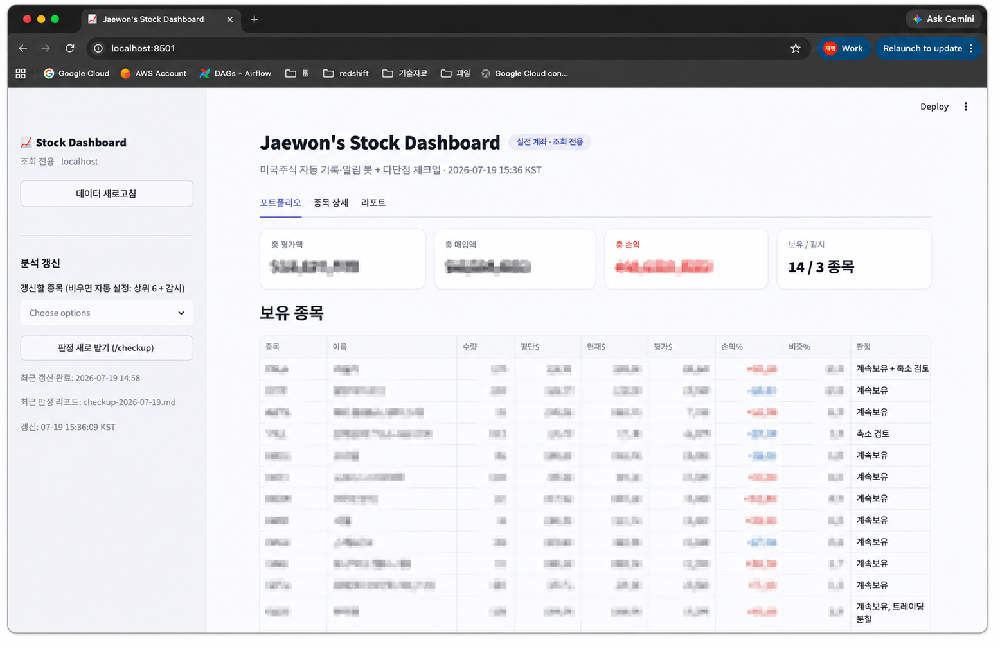
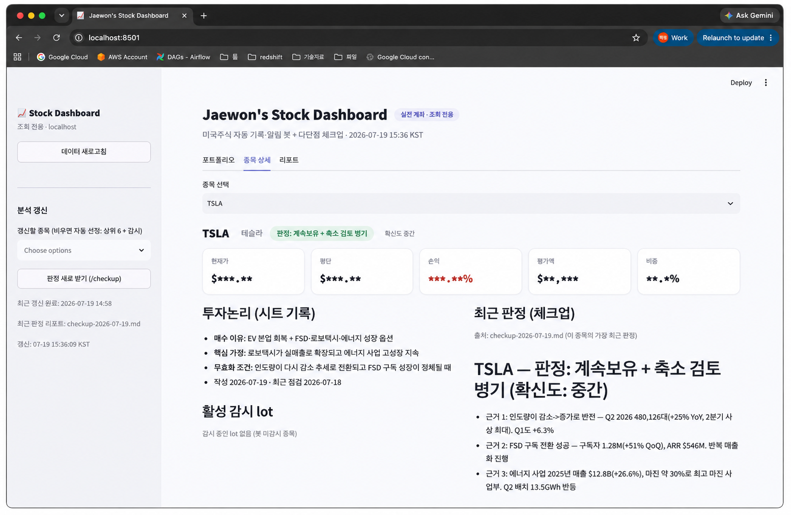
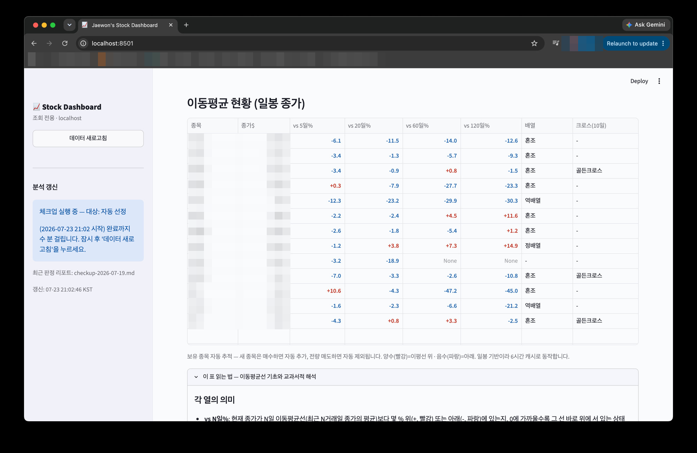

# stock-alert

한국투자증권 계좌의 미국주식 체결을 구글시트에 자동 기록하고,
매수/매도 건별(lot)로 ±10% 조건 알림(카카오톡·이메일)을 보내는 개인용 봇.

## 동작 요약

- 5분마다 한투 오픈API로 체결내역을 조회해 시트 `거래내역` 탭에 기록 (전 종목)
- 감시 종목(`설정` 탭)의 매수 건이 기준가 대비 -10% → 추가매수 알림, +10% → 매도 알림
- 매도 후 매도가 대비 -10% → 재매수 알림
- 조회 전용: 주문 API는 사용하지 않으므로 봇이 매매할 위험이 없음

## 시작하기

1. `docs/03-setup-guide.md` 따라 한투 앱키·카카오·구글 서비스계정 준비, `.env` 작성
2. `python3 -m venv .venv && .venv/bin/pip install -r requirements.txt`
3. `python scripts/init_sheet.py` — 시트 탭/헤더 생성
4. `python -m src.main --once` — 1회 실행 테스트
5. launchd 등록(가이드 8절)으로 상시 구동

## 대시보드 (로컬 웹)

```
.venv/bin/streamlit run dashboard/app.py   # 저장소 루트에서
```

http://localhost:8501 — 보유 현황·실질 노출·종목별 판정(체크업)·투자논리·알림/매매 이력.
localhost 전용. 계좌 정보가 표시되므로 외부에 배포하지 않는다.

포트폴리오 탭 — 보유 현황과 체크업 판정:



종목 상세 탭 — 투자논리와 최근 판정:



이동평균 현황 — 보유 전 종목 자동 추적(5/20/60/120일, 배열·크로스):



## 문서

- 설계: `docs/02-design.md`
- 사전조사(2026-07-15): `docs/01-research.md`
- 셋업 가이드: `docs/03-setup-guide.md`

## 테스트

```
.venv/bin/pytest
```

lot 판정 로직(`src/lot_engine.py`)은 순수 함수로 분리되어 있고,
`tests/test_lot_engine.py`가 설계의 예시 시나리오를 그대로 재현한다.
