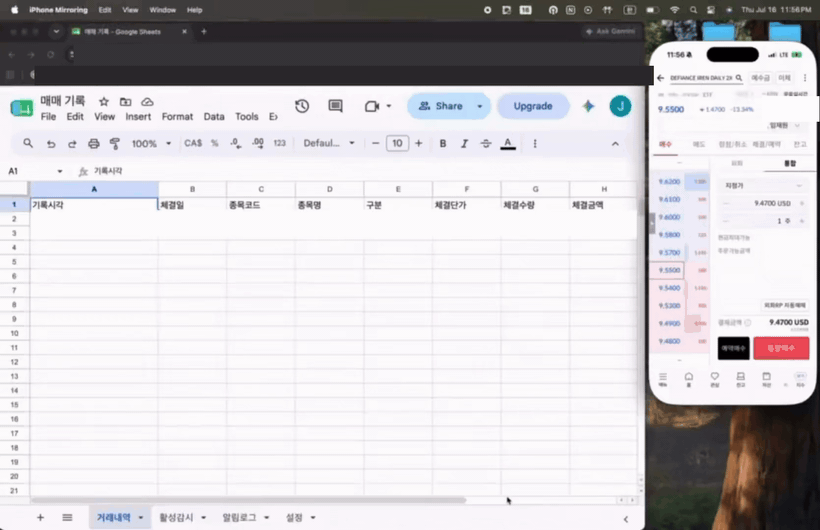

# stock-alert

A personal bot that automatically records US-stock executions from a
Korea Investment & Securities (KIS) account into Google Sheets, and sends
per-purchase-lot ±10% alerts via KakaoTalk (with email fallback).

## How it works

- Polls the KIS open API every 5 minutes during US market hours and records
  new executions into the 거래내역 (trade log) tab — all tickers
- For watched tickers (설정 tab): a buy lot down 10% from its base price →
  buy-more alert; up 10% → sell alert
- After a sell: price dropping 10% below the sell price → re-entry alert
- Read-only: order APIs are never used, so the bot cannot place trades

Auto-recording demo — buy on the phone, the bot logs it to the sheet within minutes:



## Getting started

1. Follow `docs/03-setup-guide.md` to prepare KIS app keys, Kakao, and a
   Google service account, then write `.env`
2. `python3 -m venv .venv && .venv/bin/pip install -r requirements.txt`
3. `python scripts/init_sheet.py` — creates the sheet tabs/headers
4. `python -m src.main --once` — single test cycle
5. Register with launchd (guide §8) for always-on operation

## Dashboard (local web)

```
.venv/bin/streamlit run dashboard/app.py   # from the repo root
```

[http://localhost:8501](http://localhost:8501) — holdings, effective exposure,
per-ticker AI verdicts (checkup), investment theses, alert/trade history.
localhost only: the dashboard shows the whole account, so never deploy it externally.

Portfolio tab — holdings and checkup verdicts:


Ticker detail tab — investment thesis and latest verdict:


Moving averages — auto-tracked for every holding (5/20/60/120-day, stack & crosses):


## Blog posts (the build story)

- [AI 멀티 에이전트로 주식비서 만들기](https://medium.com/@jaelim095/ai-%EB%A9%80%ED%8B%B0-%EC%97%90%EC%9D%B4%EC%A0%84%ED%8A%B8%EB%A1%9C-%EC%A3%BC%EC%8B%9D%EB%B9%84%EC%84%9C-%EB%A7%8C%EB%93%A4%EA%B8%B0-2244199cf8f9)
- [Building an AI Stock Assistant with Multi-Agents (EN)](https://medium.com/@jaelim095/building-an-ai-stock-assistant-with-multi-agents-0b7b7130439e)

## Docs

- Design: `docs/02-design.md`
- Prior research (2026-07-15): `docs/01-research.md`
- Setup guide: `docs/03-setup-guide.md`

## Tests

```
.venv/bin/pytest
```

The lot decision logic (`src/lot_engine.py`) is pure functions, and
`tests/test_lot_engine.py` replays the design doc's example scenarios verbatim.
